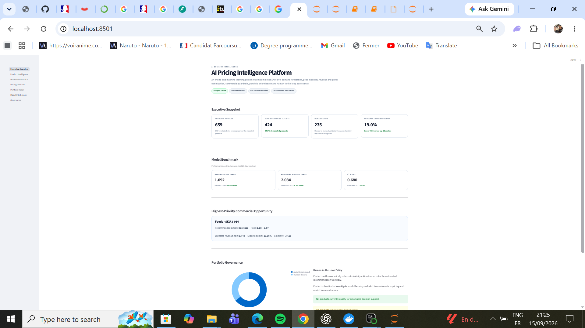
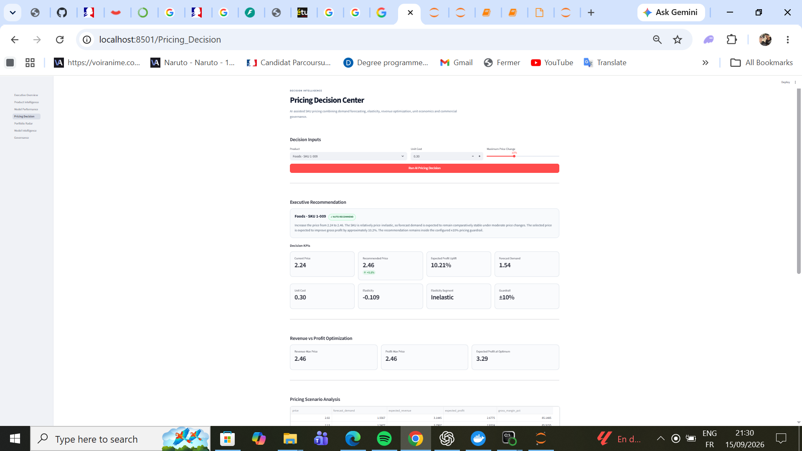
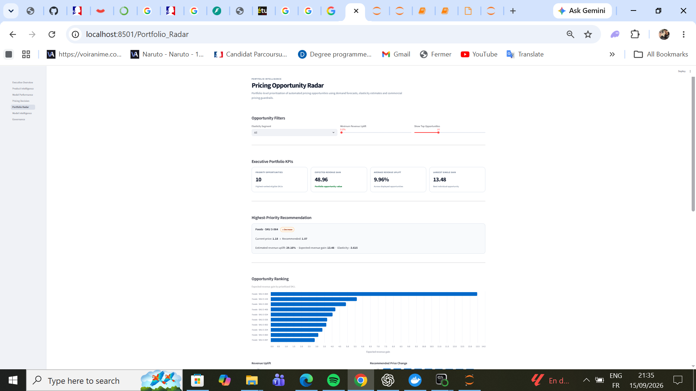
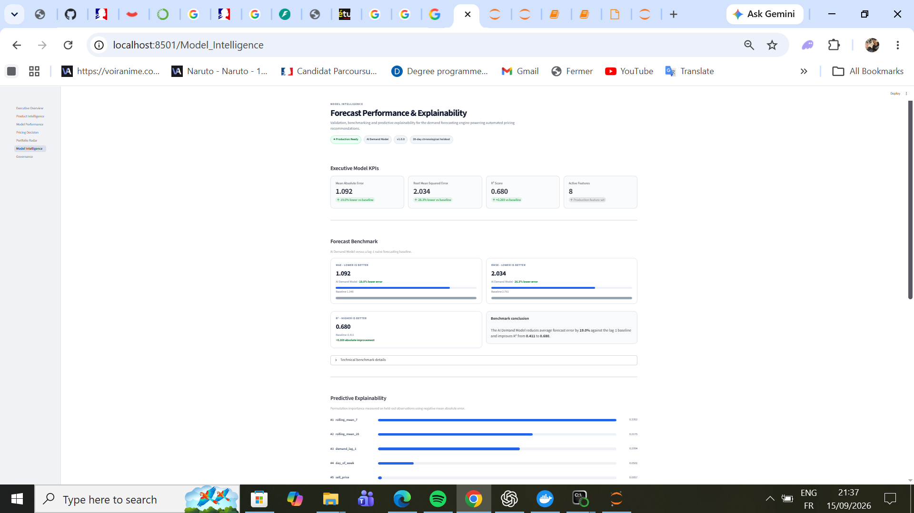
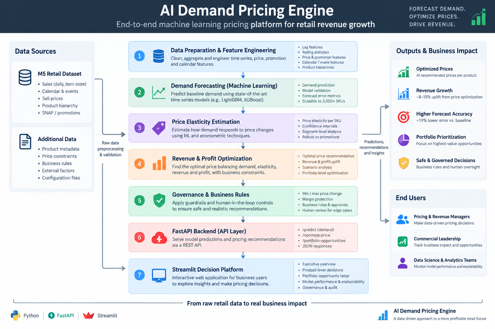

# AI Pricing Intelligence Platform
 An end-to-end machine learning pricing decision system that forecasts SKU demand, estimates product-level price sensitivity, and recommends revenue-aware prices under governance constraints.

Built on large-scale retail data, the platform turns historical demand and pricing signals into actionable pricing decisions across **659 retail products**.

## Key Results

- **R²: 0.68** on the demand forecasting holdout period
- **MAE: 1.09** vs. **1.35** for the lag-1 baseline
- **RMSE: 2.03** vs. **2.76** for the baseline
- Product-level elasticity profiles for **659 SKUs**
- Automated **AUTO_RECOMMEND / MANUAL_REVIEW** governance logic
- End-to-end deployment through **FastAPI + Streamlit**

## Project Overview

The platform combines:

- Demand forecasting
- SKU-level price elasticity estimation
- Revenue-aware price optimization
- Automated pricing recommendations
- Commercial guardrails
- Portfolio opportunity ranking
- Human-in-the-loop governance
- Model monitoring and explainability
- FastAPI backend
- Streamlit decision dashboard

The elasticity estimates are observational decision-support signals rather than causal estimates, and suspicious or economically inconsistent results are routed to manual review.


## Platform Preview

### Executive Overview



### AI Pricing Decision



### Portfolio Opportunity Radar



### Model Performance & Explainability



## System Architecture



## Business Problem

Pricing teams need to balance demand, revenue, profitability and customer price sensitivity while avoiding unrealistic or risky automated price changes.

This project turns forecasting and elasticity estimates into governed pricing recommendations that can be reviewed at product and portfolio level.

## Key Results

| Metric | AI Model | Lag-1 Baseline |
| --- | ---: | ---: |
| MAE | 1.092 | 1.348 |
| RMSE | 2.034 | 2.761 |
| R² | 0.680 | 0.411 |

**MAE improvement versus baseline: ~19%**

Evaluation uses a chronological 28-day holdout.

## Portfolio Coverage

- 659 modeled products
- 424 auto-recommend eligible products
- 235 products routed to human review
- 19 products classified as elastic
- Portfolio-wide opportunity ranking

## Demand Forecasting

Forecasting model: **HistGradientBoostingRegressor**

Current features:

- sell_price
- day_of_week
- month
- year
- demand_lag_1
- demand_lag_7
- rolling_mean_7
- rolling_mean_28

## Price Elasticity

Product-level price sensitivity is estimated using controlled Poisson regression models.

Products are classified as **Elastic**, **Inelastic**, or **Investigate**.
Across the 659 modeled products:

- **405 Inelastic**
- **19 Elastic**
- **235 Investigate**

This means **424 products are eligible for automated pricing recommendations**, while **235 products (~36%) are deliberately routed to human review** because their elasticity signal is not sufficiently reliable or economically consistent for automatic repricing.

> **Governance principle:** The system does not force a pricing recommendation when the evidence is weak or suspicious. Uncertain products remain under human review rather than being repriced automatically.

Products with suspicious or economically incoherent elasticity estimates are prevented from automatic repricing and routed to human review.

> Elasticity estimates are observational decision-support estimates and should not be interpreted as causal effects.

## Pricing Optimization

For eligible products, the engine forecasts demand, retrieves elasticity, generates candidate prices, simulates demand response, estimates revenue and profit, applies commercial guardrails, and produces an executive recommendation.

The platform supports both **revenue-maximizing** and **profit-maximizing** pricing.

> **Cost data note:** The M5 dataset does not provide product unit costs. For profit optimization, `unit_cost` is therefore supplied as an external business input rather than predicted by the model. In a real deployment, this value would typically come from an ERP, finance system, or product master-data source. Revenue optimization can operate without unit-cost data.

## Governance

Automatic recommendations require:

- Accepted elasticity
- Automation eligibility
- Price inside configured guardrails
- Price above unit cost
- Positive expected profit

Products failing these checks remain under human review.

## Portfolio Opportunity Radar

The portfolio engine ranks high-value repricing opportunities using:

- Current price
- Recommended price
- Price change
- Forecast demand
- Expected revenue gain
- Expected revenue uplift
- Elasticity
- Product classification

## Model Explainability

Permutation feature importance is calculated using held-out forecasting observations.

SHAP was also explored during model development; permutation importance was retained for the deployed explainability layer because it provides a model-agnostic measure aligned with the holdout evaluation workflow.

The strongest predictive signals include rolling demand, lagged demand, calendar effects and price.

> Predictive importance should not be interpreted as causal importance.

## Technology Stack

**Machine Learning:** Python, NumPy, pandas, scikit-learn, HistGradientBoostingRegressor, Poisson regression, joblib

**Backend:** FastAPI, Pydantic, Uvicorn

**Frontend:** Streamlit, Altair

**Testing:** pytest, FastAPI TestClient

**Development:** Jupyter Notebook, Anaconda

## API

Main endpoints:

```text
GET  /
GET  /health
GET  /elasticity/{item_id}
POST /forecast
POST /recommend-price
GET  /recommend-auto/{item_id}
POST /recommend-profit-auto
GET  /portfolio-opportunities
GET  /model-info
GET  /feature-importance
```
Local Swagger documentation:

```text
http://127.0.0.1:8001/docs
```
### Example — Profit-Aware Pricing Recommendation

Request:

```json
{
  "item_id": "HOBBIES_1_295",
  "unit_cost": 0.32,
  "max_change_pct": 0.10
}
```

Endpoint:

```text
POST /recommend-profit-auto
```

The endpoint returns a pricing recommendation combining demand, elasticity, revenue, profit and governance checks.

The response also includes:

- `decision_summary` — plain-English explanation of the recommendation
- `governance_checks` — validation of pricing guardrails and decision rules
- recommendation status such as `AUTO_RECOMMEND` or a review/validation outcome

> **Cost data note:** `unit_cost` is supplied externally because product cost is not available in the M5 dataset.
## Dashboard

The Streamlit application includes:

- Executive Overview
- Product Intelligence
- Model Performance
- Pricing Decision
- Portfolio Radar
- Model Intelligence
- Governance

## Automated Testing

The project currently passes **16 automated tests** covering the API, pricing logic, commercial guardrails, portfolio ranking, model information and feature importance.

```text
16 passed
```

## Architecture

```text
M5 Retail Data
      ↓
Feature Engineering
      ↓
Demand Forecasting
      ↓
Product-Level Elasticity
      ↓
Pricing Simulation
      ↓
Revenue & Profit Optimization
      ↓
Governance Layer
      ↓
FastAPI Decision Engine
      ↓
Streamlit Decision Intelligence Platform
```

## Running Locally

Start the backend:

```bash
python -m uvicorn api.app:app --host 127.0.0.1 --port 8001
```

Start the frontend:

```bash
python -m streamlit run dashboard/Executive_Overview.py
```

Run automated tests:

```bash
python -m pytest tests -v
```

## Limitations

- Elasticity estimates are observational rather than causal.
- Historical demand does not guarantee future demand.
- Profit optimization currently relies on supplied unit cost.
- Recommendations should be validated before real production use.
- Current evaluation uses lag-based one-step-ahead predictions rather than a fully recursive 28-day forecast.

## Future Improvements

- Recursive multi-step forecasting
- Inventory constraints
- Promotion effects
- Competitor pricing
- Prediction uncertainty
- Drift monitoring
- Automated retraining
- Cloud deployment
- CI/CD
- Docker containerization

## Project Positioning

**Data engineering → forecasting → price sensitivity → optimization → API engineering → decision dashboard → explainability → governance → automated testing**

The objective is not only to predict demand, but to transform model outputs into controlled, interpretable and commercially actionable pricing decisions.
